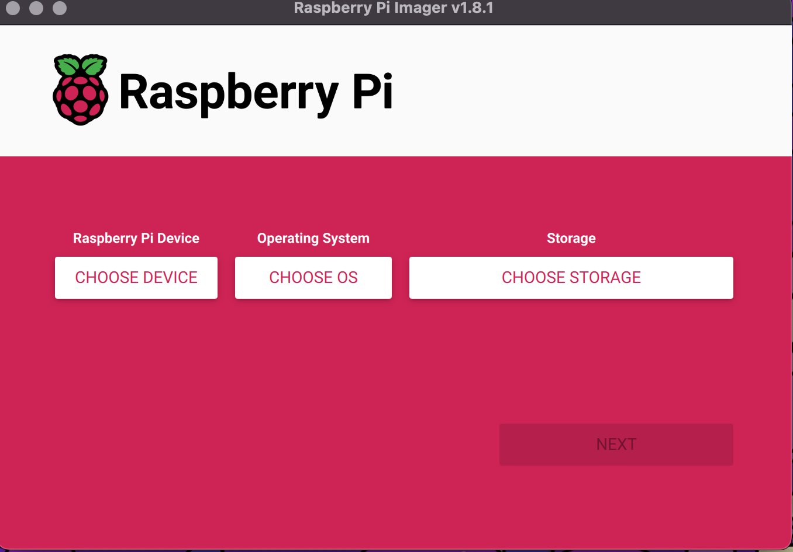
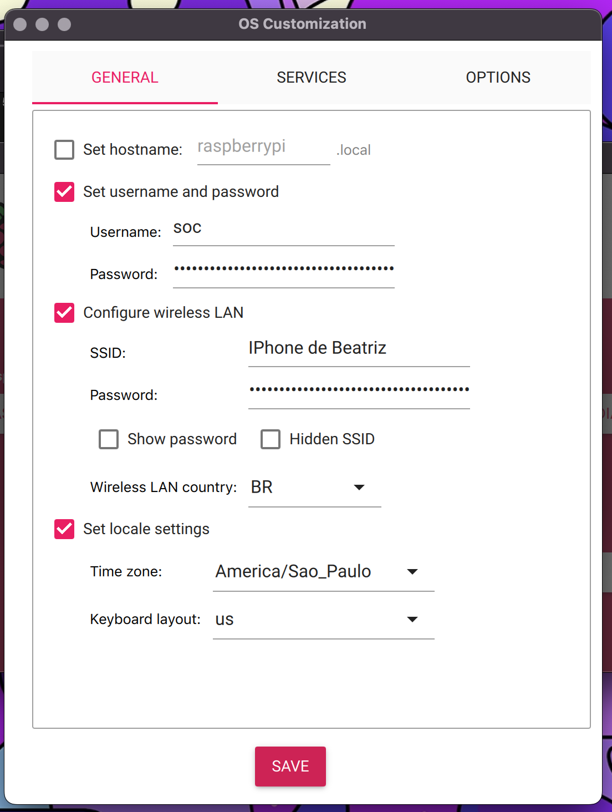
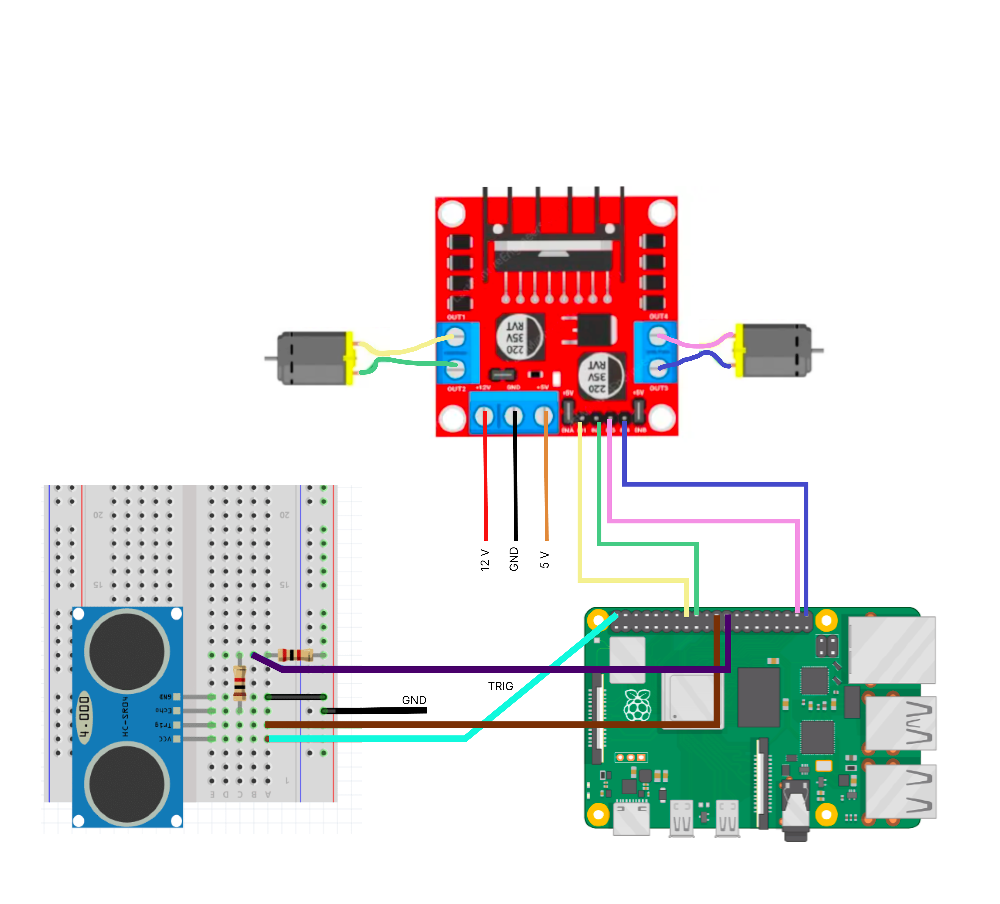
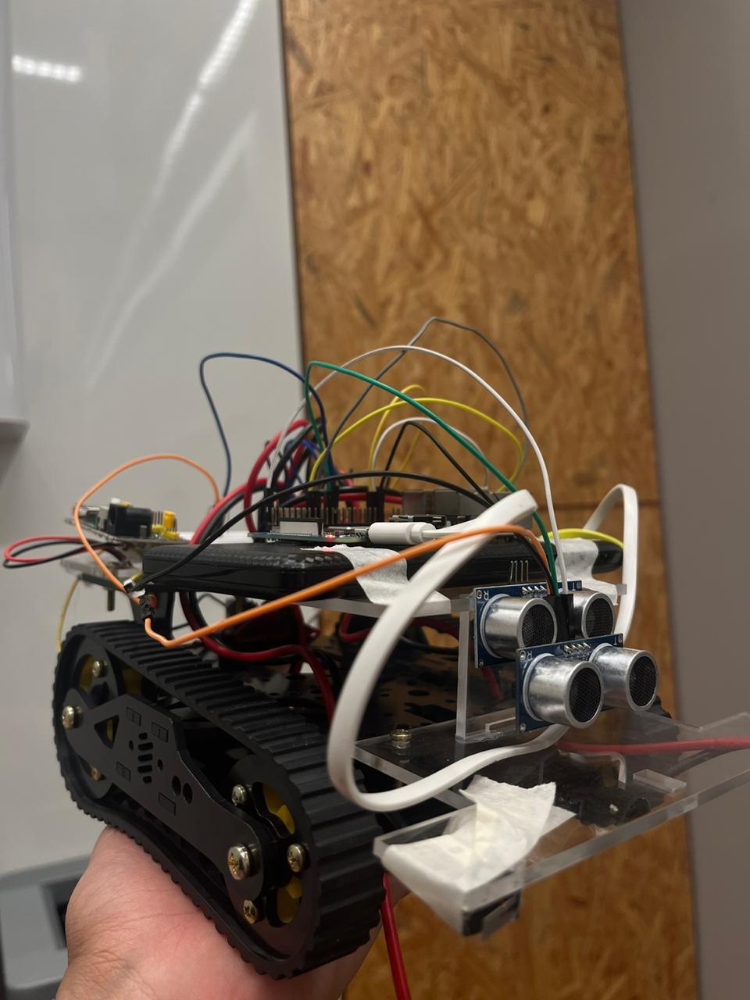
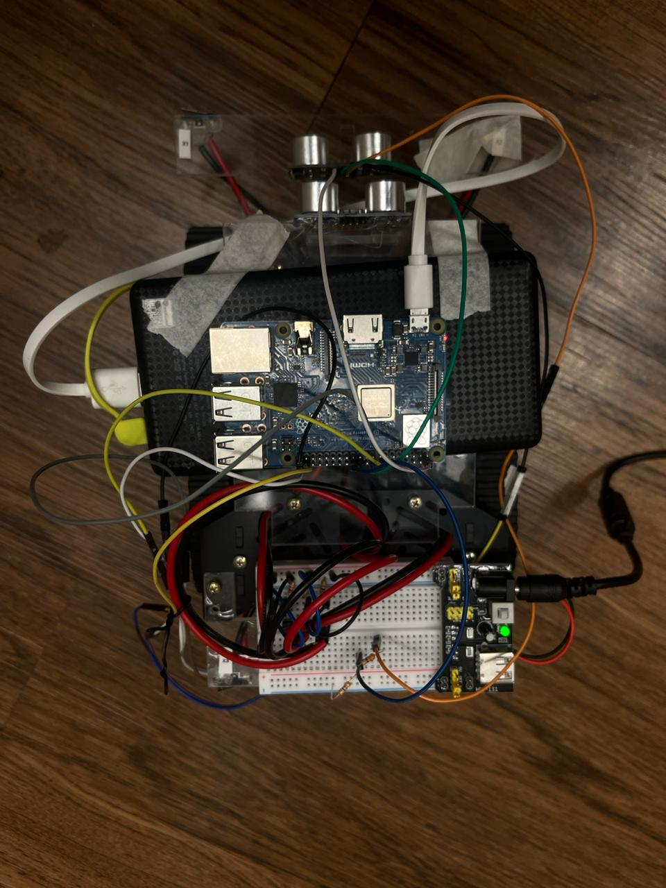
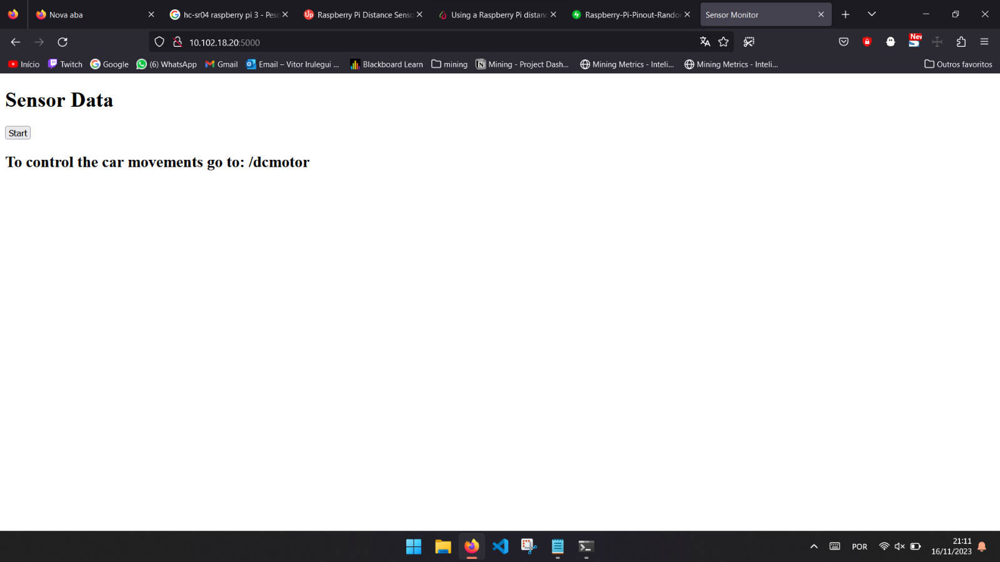
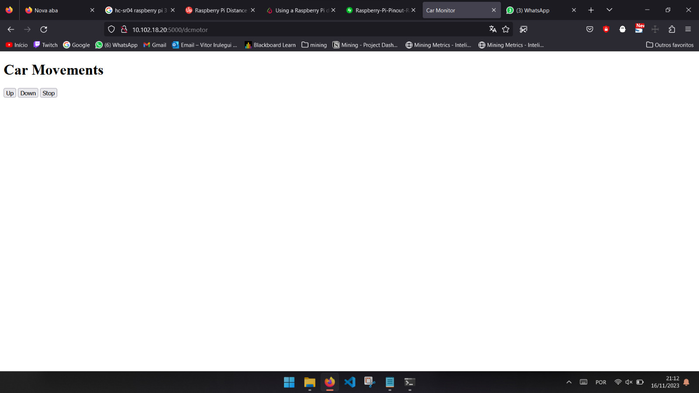

# Controlador de motor através do Flask e RaspberryPI 

- **Alunes:** Beatriz Rianho Bernardino, Vitor Irulegui Bueno Bandeira
- **Curso:** Engenharia da Computação
- **Semestre:** 10/ 7
- **Contato:** beatrizrb@al.insper.edu.br, vitoribb@al.insper.edu.br
- **Ano:** 2023

## Começando

Para seguir esse tutorial é necessário:

- **Hardware:** RaspberryPi 3B+, HCSR04, 2 motores DC, microSD 32gb,l298 Motor Driver
- **Softwares:** RaspberryPi Imager, Flask
- **Documentos:** [controlling a dc motor](https://www.theengineeringprojects.com/2018/05/how-to-control-dc-motor-with-raspberry-pi-3.html), 
                  [using a ultrassonic sensor](https://pimylifeup.com/raspberry-pi-distance-sensor/)

## Motivação

Esse projeto tem como motivação o funcionamento de uma RaspberryPi integrada com um servidor Flask, visando compreender melhor como diferentes componentes podem se integrar para criar soluções funcionais. Além disso, sistemas embarcados são amplamente utilizados no mercado, portanto esse projeto tem como objetivo a melhor compreensão sobre como embarcar sistemas operacionais em um hardware, além de entender melhor os GPIOS e integrações com outros componentes.

----------------------------------------------

## Tutorial


### **Embarcando o Linux na RaspberryPI**

Para começar o projeto, primeiro é preciso embarcar um sistema operacional na Raspi. Desse modo, acesse [esse link](https://www.raspberrypi.com/software/) e baixe o raspberryPi imager.

Após abrir o programa, vamos fazer as configurações necessárias para podermos usar o wifi na placa. Desse modo, insira o microSD no seu computador e abra o programa: 



Configure desse Modo:

??? example  "Configurações Gerais"

    1) Em **Choose Device**  :arrow_right: Escolha RaspberryPi 3 (modelo utilizado no tutorial)

    2) Em **Choose OS** :arrow_right: clique em other general purpose OS e UBUNTU :arrow_right: selecionar ubuntu Server 20.04 lts (64-bit)

    3) Em **Choose Storage** :arrow_right: escolha seu microsd como o storage

    4) Clique em **next**

Nesse momento, aparecerá um tela perguntando se você gostaria de aplicar configurações personalizadas :arrow_right: clique em **EDIT SETTINGS**:


??? example  "OS Customization"

    Na Aba General, selecione a opção de utilizar um username e password e coloque os dados de acordo com sua preferência. Em seguida, Marque a opção **configure wireless LAN:**  O **SSID** é o nome da rede WIFI em que você quer se conectar, e password, a senha rede.

    Depois disso, clique em **set locale zone**, e configure de acordo com suas preferências e localização.

    No fim, você deve ter algo parecido com:

    {width=400}

    Por fim, na aba **Services**, selecione o Enable SSH e em seguida, **Use password authentication**


Salve as alterações e por fim, clique em **YES** para usar as alterações. 

!!! warning
    Todos os dados do seu MicroSD serão apagados, então certifique-se que não tem nada de importante nele.


Espere a imagem ser transferida e insira seu microSD na Raspi. Depois disso, ligue-a e conecte um teclado, mouse e Monitor nela. Ao ligar, ela vai bootar e depois de cerca de 2 minutos, aparecerá um tela pedindo o usuário e senha setados previamente. Logue no sistema, e você terá acesso ao ubuntu pela Raspi.


!!! tip 
    Tente pingar alguma url para ter certeza que o wifi foi configurado corretamente. 

  
!!! tip 
    Para se conectar com ela via SSH, primeiro descubra seu IP. Para isso, digite no terminal:

        hostname -l

    Em um computador, abra um terminal e se conecte com ela, através do IP acima. Para isso:

        ssh nome-de-usuario@IP-da-RaspberryPI


### **Conectando os componentes na placa**

Agora, siga esse diagrama para conectar os componentes com a raspberryPi. Aqui, utilizaremos dois motores, um sensor ultrassônico, um motor DC e resistores de 1k Ω  e 2k Ω para conectar tudo. Se baseie também no [PINOUT](https://www.raspberrypi.com/documentation/computers/raspberry-pi.html) da placa para escolher os GPIOS.





!!! warning
    O GND da placa e dos componentes devem estar conectados juntos.


A montagem final deve ficar parecido com as imagens a seguir. Nela, o diagrama foi montado na estrutura de um carrinho, para que seja possível fazê-lo andar através do servidor Flask:


{width=400} {width=400}


### **Criando um servidor Flask**


Comece instalando o Flask e as bibliotecas necessárias na Raspi. Para isso acesse a plaquinha e em um terminal rode:

```python 
$ pip install Flask
$ pip install time
$ sudo apt-get update
$ sudo apt-get install rpi.gpio
```


Agora, crie um arquivo **app.py** que terá nosso servidor. Nele, teremos duas principais rotas: 

**1) "/":**  rota inicial em que o carrinho começa a andar pra frente até encontrar um objeto a uma distância menor que 20cm;

**2) "/dcmotor":** Conterá botões para fazer o carrinho ir para frente, para trás ou parar.


Os GPIOS utilizados estão de acordo com o diagrama acima. Caso você tenha conectado de maneira diferente, altere o código para ficar de acordo:


```python
from flask import Flask, render_template, request
import time
import RPi.GPIO as GPIO
import keyboard

# Set up GPIO
# E = esquerda
# D = direita
# F = frente
# T = trás

MotorDF = 16
MotorDT = 18
MotorEF = 38
MotorET = 40
PIN_TRIGGER = 22
PIN_ECHO = 24


GPIO.cleanup()
GPIO.setwarnings(False)
GPIO.setmode(GPIO.BOARD) 
GPIO.setup(MotorET, GPIO.OUT)
GPIO.setup(MotorDF, GPIO.OUT)
GPIO.setup(MotorDT, GPIO.OUT)

GPIO.setup(PIN_TRIGGER, GPIO.OUT)
GPIO.setup(PIN_ECHO, GPIO.IN)


GPIO.output(MotorEF, GPIO.LOW)
GPIO.output(MotorET, GPIO.LOW)
GPIO.output(MotorDF, GPIO.LOW)
GPIO.output(MotorDT, GPIO.LOW)
GPIO.output(PIN_TRIGGER, GPIO.LOW)

# Function to move the motor1 forward
def move_backward():
  print("RE")
  GPIO.output(MotorDF, GPIO.HIGH)
  GPIO.output(MotorDT, GPIO.LOW)
  GPIO.output(MotorEF, GPIO.HIGH)
  GPIO.output(MotorET, GPIO.LOW)

# Function to move the motor1 backward
def move_forward():
  print("ACELERA")
  GPIO.output(MotorDF, GPIO.LOW)
  GPIO.output(MotorDT, GPIO.HIGH)
  GPIO.output(MotorEF, GPIO.LOW)
  GPIO.output(MotorET, GPIO.HIGH)

# Function to stop the motor
def stop_motor():
  print("PARADO")
  GPIO.output(MotorDF, GPIO.LOW)
  GPIO.output(MotorDT, GPIO.LOW)
  GPIO.output(MotorEF, GPIO.LOW)
  GPIO.output(MotorET, GPIO.LOW)


def ultrassonic_sensor():

  print("Waiting for sensor to settle")

  time.sleep(2)

  print("Calculating distance")
  pulse_start_time=0
  pulse_end_time=0
  pulse_duration=0
  distance= 10000
  while distance > 20:
    move_forward()

    GPIO.output(PIN_TRIGGER, GPIO.HIGH)

    time.sleep(0.00002)

    GPIO.output(PIN_TRIGGER, GPIO.LOW)

    while GPIO.input(PIN_ECHO)==0:
          pulse_start_time = time.time()
    while GPIO.input(PIN_ECHO)==1:
          pulse_end_time = time.time()

    pulse_duration = pulse_end_time - pulse_start_time
    distance = round(pulse_duration * 17150, 2)
    print("Distance:",distance,"cm")
    time.sleep(0.1)
  print("distancia passou:", distance)
  stop_motor()


app = Flask(_name_)

@app.route("/", methods=["POST", "GET"])
def hello_world():
    if request.method == "POST":
      if request.form.get('start') == "Start":
          ultrassonic_sensor()
    return render_template('index.html')


@app.route("/dcmotor", methods=['POST','GET'])
def dc_motor():
    if request.method == 'POST':
        if request.form.get('up') == 'Up':
            move_forward()
        elif request.form.get('stop') == 'Stop':
            stop_motor()
        elif request.form.get('down') == 'Down':
            move_backward()
    return render_template('motor.html')


if _name_ == '_main_':
    app.run(debug=True, host='0.0.0.0')

```

O código acima controla o acionamento dos motores setando seu estado para HIGH ou LOW. Por outro lado, a função  do sensor ultrassônico recebe os dados do Pino ECHO e calcula a distância que ele está de um objeto. 


O nosso servidor terá duas páginas, e, por isso, precisamos criar os respectivos HTMLs. Para isso, no mesmo diretório crie uma pasta chamada templates, e, dentro dela, criaremos dois arquivos:


??? example "motor.html"

    ```HTML
        <!DOCTYPE html>
        <html lang="en">
        <head>
            <meta charset="UTF-8">
            <meta name="viewport" content="width=device-width, initial-scale=1.0">
            <title>Car Monitor</title>
        </head>
        <body>
            <h1>Car Movements</h1>
            <form method="post" action="/dcmotor">
                <input type="submit" value="Up"   name="up"/>
                <input type="submit" value="Down" name="down"/>
                <input type="submit" value="Stop" name="stop"/>
            </form>
        </body>
        </html>
    ```


??? example "index.html"

    ```HTML
      <!DOCTYPE html>
        <html lang="en">
        <head>
            <meta charset="UTF-8">
            <meta name="viewport" content="width=device-width, initial-scale=1.0">
            <title>Sensor Monitor</title>
        </head>
        <body>
            <h1>Sensor Data</h1>
            <form method="post" action="/">
                <input type="submit" value="Start"  name="start"/>
            </form>
            <h2>To control the car movements go to: /dcmotor </h2> 
        </body>
        </html>
    ```


!!! note

    Esses arquivos possuem formulários simples com botões para o usuário controlar o carro. Fique livre para adequar a sua preferência.


Com tudo criado, chegou a hora de rodar nosso servidor. Para isso, rode no terminal:

    $ python3 app.py

Se você acessar o seu localhost na porta 5000, deve obter algo como:




Na rota "/dcmotor":



Com isso, seu servidor esta pronto! No terminal as distâncias que o sensor está identificando são printadas constantemente. Note que ao detectar um objeto a 20 cm de distância ele começa a parar, mas devido a sua velocidade e inércia ele só para quando tiver bem perto do objeto. Portanto, ajuste esse valor de acordo com a necessidade.


!!!info "Video"

    Para ver um exemplo do carrinho andando com o servidor, acesse esse [link](https://drive.google.com/file/d/1Xy_X8TsnwNFYz8ry4tk4xXylpADvaI3L/view?usp=drivesdk)

